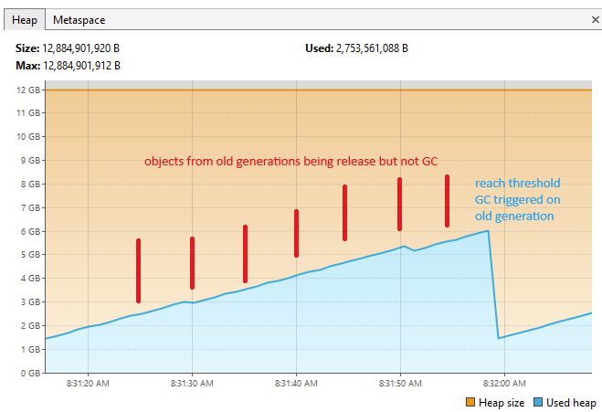

# gc-testing

This is a repository for testing the Java Garbage Collection especially the G1GC.

⚠️ These observations, tests and studies were carried out in less than an hour as part of a debugging session. 
Please note that the information may not be accurate.

## Configure your IDE

## Short explanation

Assuming that we have the following configuration
- 12GB Heap size min/max
- using G1GC as garbage collection algorithm

The heap is fragmented into several regions, and these regions are defined into several types. To put it simply, young generation and old generation. Old generation corresponds to objects that have survived several garbage collection cycles.

Regardless of HEAP size or occupation, the young generation is regularly GC.
Unlike the older generation, which is triggered when a certain threshold is reached. (Please note that there are many rules [like Full GC when heap size exhausted] and special cases to take into account, so these are only brief explanations).
This threshold can be configured using -XX:InitiatingHeapOccupancyPercent=45 otherwise by default it is set to 45% of the heap. It means, after 45% heap occupancy, this will trigger, the so-called “Mixed Collections”, which will perform a GC across all generations.

According to our configuration, at 5.4GB we should see a significant garbage collection trigger.

